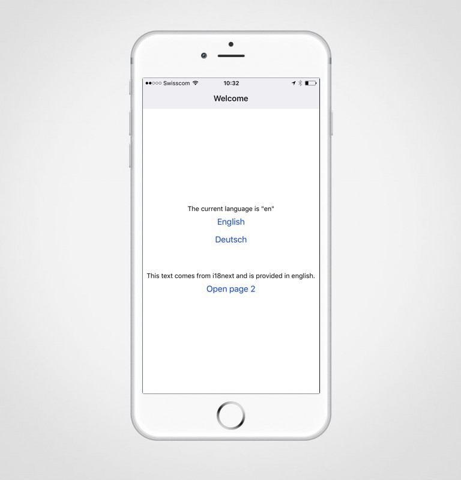

# create-react-native-app
## Translate your expo.io (react-native) mobile application

The README for this package is hosted at https://github.com/react-community/create-react-native-app.

## Development

`yarn && yarn start` will start a watcher that will build artifacts and place them in the build directory.
```
yarn
yarn start
```
or
```
npm install
npm i i18next react-i18next --save
npm i react-i18next
```
## For the legacy version please use the v9.x.x Branch

```
$ v9.0.10 (legacy)
npm i react-i18next@legacy
```
```
npm start
```
```
expo start
```
<p align="center"></p>
<p align="center"></p>
<br>
<p align="center"></p>

## Links
- https://expo.io/
- http://i18next.com/
- https://github.com/react-community/create-react-native-app
- https://github.com/i18next/react-i18next/tree/master/example/v9.x.x/reactnative-expo


> Renato Lucena - 2020
@cpdrenato